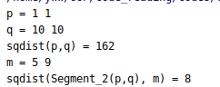

# Code Reading Assignment Report

Wuwei Yuan, 2020040054

## Basic Part

### Configuration

To compile projects with CGAL using cmake, we need to include some files and link some libraries as follows:

```cmake
cmake_minimum_required(VERSION 3.15)
project(codes)

set(CMAKE_CXX_STANDARD 17)

find_package(CGAL REQUIRED) # find package
include(${CGAL_USE_FILE}) # include files

add_executable(codes main.cpp)

target_link_libraries(codes ${CGAL_LIBS}) # link libraries
```

~~By the way, the compilation is a bit slow and my computer often crashes~~.

After compiling, we can run the executable file without any command line arguments:

```text
./codes
```

### Running Results

I run an example from CGAL tutorial. It can tell you the distance between two points, or between a segment and a point. The code is as below:

```c++
#include <iostream>
#include <CGAL/Simple_cartesian.h>

typedef CGAL::Simple_cartesian<double> Kernel;
typedef Kernel::Point_2 Point_2;
typedef Kernel::Segment_2 Segment_2;

int PointsAndSegment() {
  Point_2 p(1, 1), q(10, 10);
  std::cout << "p = " << p << std::endl;
  std::cout << "q = " << q.x() << " " << q.y() << std::endl;
  std::cout << "sqdist(p,q) = "
            << CGAL::squared_distance(p, q) << std::endl;

  Segment_2 s(p, q);
  Point_2 m(5, 9);

  std::cout << "m = " << m << std::endl;
  std::cout << "sqdist(Segment_2(p,q), m) = "
            << CGAL::squared_distance(s, m) << std::endl;
  return 0;
}
```

The result is:



The result shows that the squared distance between $p(1,1)$ and $q(10, 10)$ is 162, while the square distance between the segment $((1, 1), (10, 10))$ and point $m(5, 9)$ is 8.

### Background

- All CGAL header files are in the subdirectory `include/CGAL`. 
- All CGAL classes and functions are in the namespace `CGAL`. 
- Classes start with a capital letter, global function with a lowercase letter, and constants are all uppercase. 
- The dimension of an object (including header files, classes etc.) is expressed with a suffix. For example, class `Point_2` corresponds points in two dimensional space.
- The geometric primitives, like the point type, are defined in a kernel.
- Besides the ordinary floating point numbers, there is another type of floating point number: "exact", which is, as the name suggests, the full precision floating point number type. Obviously, it leads to worse performance and higher memory demand.
- The functions decouple algorithms from containers by pointers and iterators, just as what the algorithms in STL do.
- In addition to kernel, you can also run the algorithms with user defined types by providing traits (predicates).
- A concept is a set of requirements on a type, namely that it has certain nested types, certain member functions, or comes with certain free functions that take the type as it. A model of a concept is a class that fulfills the requirements of the concept.


## Introduction

### Purpose

### Scope

### Reference Material

https://doc.cgal.org/latest/Manual/tutorial_hello_world.html

https://doc.cgal.org/latest/Kernel_23/index.html#Chapter_2D_and_3D_Geometry_Kernel

### Definitions and Acronyms

CGAL refers to the Computational Geometry Algorithms Library.

STL refers to the Standard Template Library.

## System Overview

## System Architecture

### Architecture Design

### Decomposition Description

## Data Design

## Human Interface Design

### Overview of User Interface

### Screen Images

## Design Patterns / Polymorphism Features

## Programming Skills