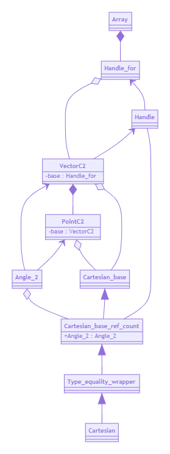
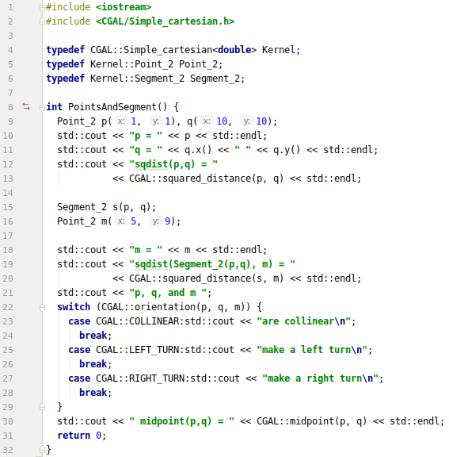

# Code Reading Assignment Report

Wuwei Yuan, 2020040054

## Basic Part

### Configuration

To compile projects with CGAL using cmake, we need to include some files and link some libraries as follows:

```cmake
cmake_minimum_required(VERSION 3.15)
project(codes)

set(CMAKE_CXX_STANDARD 17)

find_package(CGAL REQUIRED) # find package
include(${CGAL_USE_FILE}) # include files

add_executable(codes main.cpp)

target_link_libraries(codes ${CGAL_LIBS}) # link libraries
```

Then we can compile it.

```
cmake .
make
```

~~By the way, the compilation is a bit slow and my computer often crashes~~.

After compiling, we can run the executable file without any command line arguments:

```text
./codes
```

### Running Results

I run an example from CGAL tutorial. It can tell you the distance between two points, or between a segment and a point. The code is as below:

```c++
#include <iostream>
#include <CGAL/Simple_cartesian.h>

typedef CGAL::Simple_cartesian<double> Kernel;
typedef Kernel::Point_2 Point_2;
typedef Kernel::Segment_2 Segment_2;

int PointsAndSegment() {
  Point_2 p(1, 1), q(10, 10);
  std::cout << "p = " << p << std::endl;
  std::cout << "q = " << q.x() << " " << q.y() << std::endl;
  std::cout << "sqdist(p,q) = "
            << CGAL::squared_distance(p, q) << std::endl;

  Segment_2 s(p, q);
  Point_2 m(5, 9);

  std::cout << "m = " << m << std::endl;
  std::cout << "sqdist(Segment_2(p,q), m) = "
            << CGAL::squared_distance(s, m) << std::endl;
  return 0;
}
```

The result is:


The result shows that the squared distance between $p(1,1)$ and $q(10, 10)$ is 162, while the square distance between the segment $((1, 1), (10, 10))$ and point $m(5, 9)$ is 8.

### Background

- The dimension of an object (including header files, classes, etc.) is expressed with a suffix. For example, class `Point_2` corresponds points in two-dimensional space.
- A predicate has a discrete set of possible results (eg. check whether two lines are collinear), whereas a construction produces either a number, or another geometric entity (eg. calculate distance between two points).
- Besides the ordinary floating point numbers, there is another type of floating-point number: "exact", which is, as the name suggests, the full precision floating-point number type. Obviously, it leads to worse performance and higher memory demand. In addition, CGAL provides plenty of classes and other things to store 'exact' things, which will be mentioned below.

### Lines of codes read


| File                                            | Length / Lines |
| ----------------------------------------------- | -------------- |
| `Cartesian.h`                                   | 67             |
| `Kernel/Type_equality_wrapper.h`                | 55             |
| `Kernel/interface_macros.h`                     | ??? of 616     |
| `Cartesian/Cartesian_base.h`                    | 156            |
| `Cartesian/Vector_2.h`                          | 154            |
| `array.h`                                       | 202            |
| `Handle_for.h`                                  | 316            |
| `Cartesian/Point2.h`                            | 108            |
| `Origin.h`                                      | 53             |
| `Cartesian/predicates_on_points_2.h`            | 67             |
| `predicates/kernel_ftC2.h`                      | ??? of 720     |
| `constructions/kernel_ftC2.h`                   | ??? of 525     |
| `squared_distance_2_1.h`                        | ??? of 673     |
| `Kernel/global_function`                        | ??? of 1190    |
| `Cartesian/function_objects.h`                  | ??? of 4346    |
| `Point_2.h`                                     | 294            |
| `Cartesian/ft_constructions_2.h`                | 77             |
| `Exact_predicates_exact_constructions_kernel.h` | 99             |

Summary: approximate 2000 lines of codes or more.


## Introduction

### Purpose

In order to understand how CGAL works, I delve into one of the most fundamental and widely used parts of CGAL - kernel. The kernel part allows you to use algorithms without self-defined objects, predicates, and constructions.

### Scope

The kernel part as the foundation of computing geometry supports all other algorithms, and it is separated into many different kernels for different use.

### Reference Material

https://doc.cgal.org/latest/Manual/tutorial_hello_world.html

https://doc.cgal.org/latest/Kernel_23/index.html#Chapter_2D_and_3D_Geometry_Kernel

https://en.cppreference.com/w/cpp/language/dependent_name

### Definitions and Acronyms

CGAL refers to the Computational Geometry Algorithms Library.

STL refers to the Standard Template Library.

## System Overview

The kernel part contains basic non-modifiable geometric objects, related predicates, and constructions, such as 2D and 3D point classes, vector classes, calculation of angle, vector, and so on. It provides different kernels for different needs, which will be explained later.

## System Architecture

### Architecture Design

As the same as algebraic part, the kernel part also provides inexact but fast kernels for those who need performance, and exact but slow kernels for those who need precision. It also provides a kernel between the first two - a kernel with exact data and predicates, and inexact constructions. 

The Cartesian kernel provides objects, predicates, and constructions in 2D and 3D space. Because the division is needed in the constructions of the Cartesian kernel, the type of Cartesian kernel should be field type, that is, addition, subtraction, multiplication, and division are defined and behave as the corresponding operations on real numbers, such as double (the integer type is not a field type, because division is not accord with the definition). Since some users need objects with reference counting while others not, the Cartesian base kernel is separated from the Cartesian kernel. The architecture of the Cartesian kernel is the following. 

All the related objects, predicates, and constructions are defined for the Cartesian kernel and the Cartesian base kernel. The objects (eg. points, vectors) classes are predicates functions are templated that can be specialized by the specific kernel. The predicates are template functors, which can be wrapped into a traits object.

The UML Class diagram of the Cartesian kernel is shown below:



In the diagram, the class PointC2 represents objects, while the class Angle_2 represents predicates. The handle controls whether reference counting is used.

## Data Design

Each object related to the Cartesian kernel stores its data in a handle of an array with reference counting. 

## Human Interface Design

### Overview of User Interface

Since algorithm functions decouple algorithms from containers and predicates by pointers, iterators, and classes, just as what the algorithms in STL do. You can pass objects related to kernel, or self-defined objects and a traits object that wraps up predicates as arguments to algorithms to achieve your goal. Also, you can directly use the classes and functions to achieve your aim.

### Screen Images



The fourth line specifies a Cartesian kernel with double type. The next two lines use two object classes of the kernel.

In the main function, several objects are defined, constructions and predicates are used to calculate the squared distance and orientation.

## Design Patterns / Polymorphism Features

The object classes use the adapter design pattern to adapt a handle of an array to store data.

The object classes use the strategy design pattern to decide whether using reference counting (the strategy is the handle class).

The CGAL library mainly uses templates, not polymorphism features.

## Programming Skills

In line 42 & 44 of file `Kernel/Type_equality_wrapper.h`  and also line 54 `Cartesian.h` , the library lists the objects that will be used in a header file, then use macros to map them into specific usages.

The kernel class pass its class type as the type of template into the kernel base class, let it convenient to use functors which are defined for the kernel class.

In line 47 `Cartesian/Vector_2.h` , add the `template` keyword to avoid the template disambiguation for dependent names. 