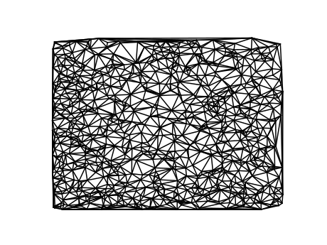
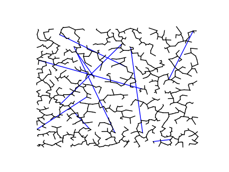

# Individual Project Report

Wuwei Yuan, 2020040054

## Introduction

### Purpose

This software design document describes the architecture and system design of my project.

## Scope

This software provides some algorithms to construct the minimal euclidean spanning tree of given points. It allows people to add more algorithms and classes if they require them.

### Reference Material

https://www.ics.uci.edu/~eppstein/pubs/Epp-BIT-92.pdf

## System Overview

This software provides classes and algorithms to construct the complete graph and the Delaunay triangulation of given points and minimal spanning tree of a graph. It also provides classes to generate test cases.

## System Architecture

### System Design

The whole system is divided into two parts: graph and data generator.

The graph part includes abstract graph class, and some construction strategy: complete graph, Delaunay triangulation, and minimal spanning tree, that can create the corresponding graph.

The data generator class can generate different points and a forest.

The UML class diagram is the following:

## Data Design

### Data Description

All the data are stored in the base class Undirected Graph, and the operations are using the corresponding interface, ie. GetNumVertices.

## Human Interface Design

### Overview of User Interface

The user can use the strategies to construct the graph they like, and interfaces of UndirectedGraph to query the vertices, edges and overall length.

### Screen Images

## Design Patterns and Polymorphism Features

The strategy classes use the strategy design pattern to construct a graph, which has better scalability.

This DelaunayTriangulation class uses the adapter design pattern to adapt the Delaunay triangulation class in CGAL.

## Programming Skills

I learned a lot of skills in using a smart pointer and sometime they'll make trouble. I also realized why we should pass the strategy as a pointer to the function.

## Experimental Results

I generate five test cases with $n=1000, m=10$ to test the correctness, the result is as follow:

| Test Case | Runtime(Complete Graph)/s | Runtime(Delaunay Triangulation)/s | Result                     |
| --------- | ------------------------- | --------------------------------- | -------------------------- |
| 1         | 0.040                     | 0.002                             | $\approx 6\times {10}^9$   |
| 2         | 0.044                     | 0.002                             | $\approx 5.3\times {10}^9$ |
| 3         | 0.050                     | 0.002                             | $\approx 4.5\times {10}^9$ |
| 4         | 0.045                     | 0.003                             | $\approx 5.3\times {10}^9$ |
| 5         | 0.045                     | 0.005                             | $\approx 4.6\times {10}^9$ |

The figures for the last test case is as follows:

This figure shows the Delaunay triangulation of the test case.

This figure shows the minimal spanning tree of the test case. The blue edges correspond to the constraints, whereas others correspond to normal edges.

I also generate some test cases to test the performance, the result shows that Delaunay triangulation is a much faster way to construct a euclidean spanning tree than constructing a complete graph.

| Algorithm              | $n$      | $m$  | Runtime/s |
| ---------------------- | -------- | ---- | --------- |
| Complete Graph         | $10000$  | $10$ | 4.16      |
| Delaunay Triangulation | $10000$  | $10$ | 0.07      |
| Delaunay Triangulation | $100000$ | $10$ | 1.14      |

## Challenging Question

The answer is yes. With many points, we can first create the Delaunay triangulation graph and merge up the  vertices of each constraint edge. After that, the question is converted to a pure minimal spanning tree problem, which can be solved in $O(n +k^2)$. See more in the referenced paper.

